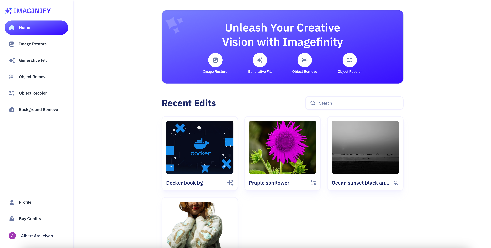

# Imagefinity


<div align="center">
  
  
  
  
  
</div>

<p align="center" style="width: 90%; margin: 0 auto">
  An amazing app for interacting with images in different ways such as <b>background removal</b>, <b>AI generative fill</b> and other ways and also for keeping and storing your images in our databases.
</p>

## Install
- After cloning the repo install dependencies
```bash
npm install
```
- Don't forget abuot `env` variables, check `.env.example` file for knowing about them and putting your **API keys**
- Also don't forget to connect your MongoDB via [MongoDB Atlas](https://www.mongodb.com/products/platform/atlas-database).
- Start the project
```bash
npm run dev
```
